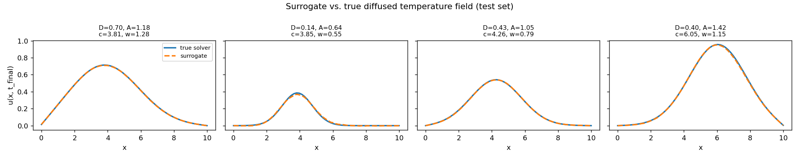
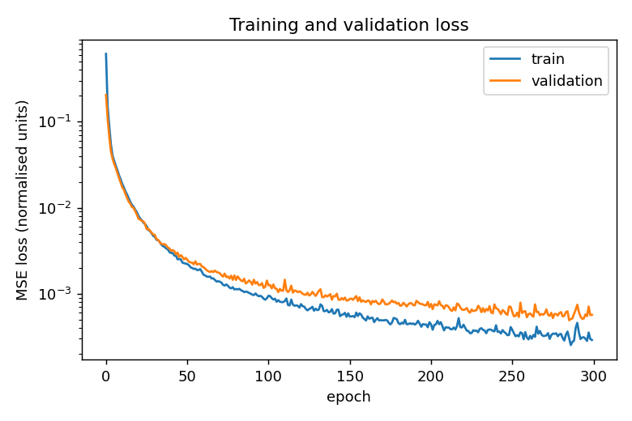

# neural-surrogate

A neural network that emulates a numerical PDE solver: it learns to map physical
parameters straight to the solution field, replacing an expensive iterative solve
with a single fast evaluation.

## Result

The surrogate reproduces the solver to 0.53% mean relative error (RMSE
$5.3\times10^{-3}$) while running about 70 times faster per query.

The error is not uniform: it grows near the edges of the training parameter ranges,
where data is sparse (correlation with distance to the boundary about $-0.29$), and
sharp, narrow profiles are harder than broad ones (0.62% against 0.43%). This is the
expected behaviour of a data driven surrogate, accurate in the dense interior and
weaker at the sparse edges of the parameter space.

## Motivation

Fitting physical models to data often means running a numerical solver many times,
which is frequently the dominant cost. In my previous research on a cosmic ray transport
solver, recovering best fit parameters by regression is exactly this kind of
repeated, expensive evaluation. This project tests whether a trained surrogate can
stand in for the solver, using the heat diffusion equation as a controlled case: it
is the pure diffusion limit of the transport equation, so it keeps the essential
structure while staying cheap to solve and easy to interpret.

## How it works

The simulator solves the 1D heat equation

$$\frac{\partial u}{\partial t} = D \ \frac{\partial^2 u}{\partial x^2}$$

with an implicit, stiff stable integrator so the training labels are reliable. 
The surrogate, a small multilayer perceptron, learns the operator

$$(D,\ A,\ \mu,\ \sigma) \longmapsto u(x,\ t=T).$$

Inputs and outputs are standardised using training set statistics only, to avoid
leaking held out data into training. Settings are in `config.yaml` and the pipeline
is unit tested, so runs are reproducible. After installing `requirements.txt`, run
`train`, `evaluate` and `analyse_errors` in order, with `pytest` covering the
pipeline.

## Limitations and next steps

The surrogate reproduces the solver's outputs, not the equation, so it encodes no
physical constraints and does not extrapolate beyond its training ranges. The speed
up is large as a ratio but this solver is cheap, so the absolute saving is modest.
The ratio becomes significant for expensive solvers evaluated many times, 
such as in regression fitting or exploring large parameter spaces, where surrogates genuinely pay off.
The natural next steps include denser sampling near the boundaries to address the edge error, 
an operator learning approach (Fourier Neural Operator) for resolution independence, 
and a physics informed objective so the model respects the equation while maintaining efficiency.